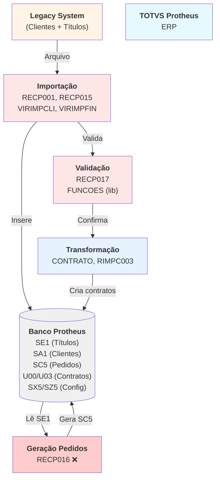
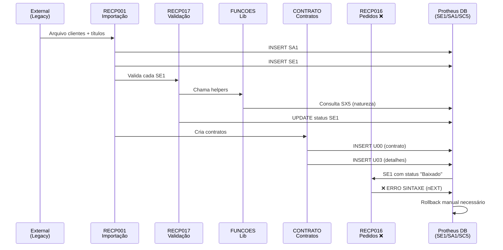
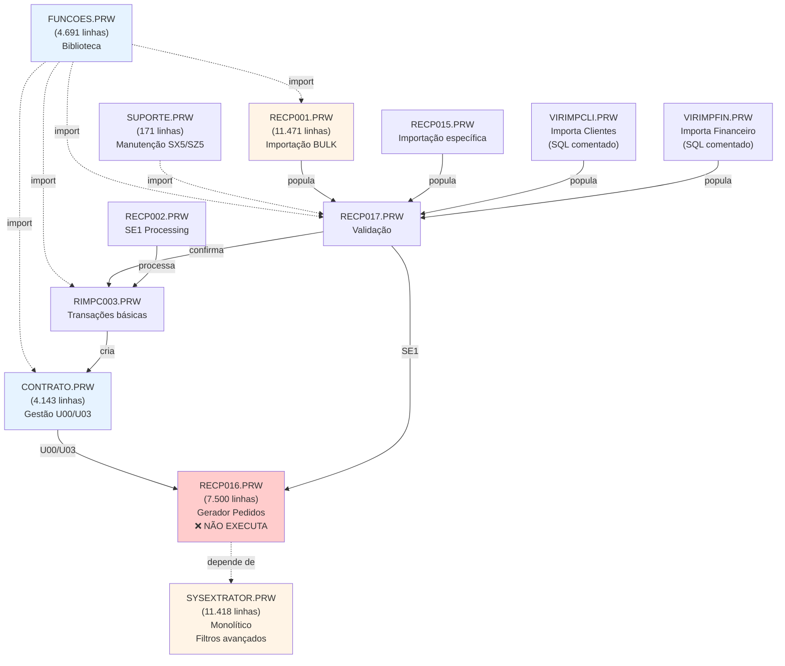
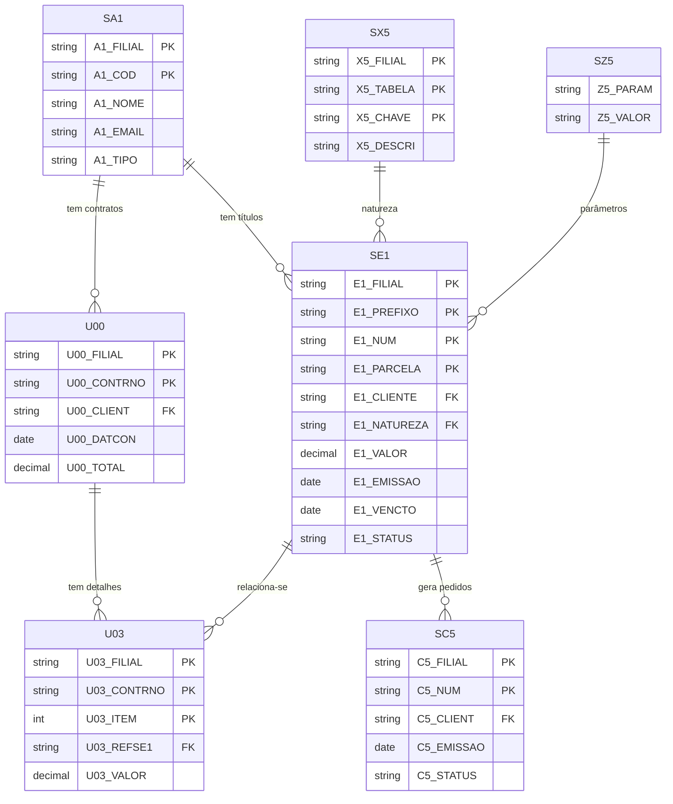
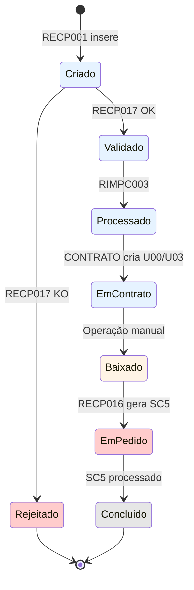
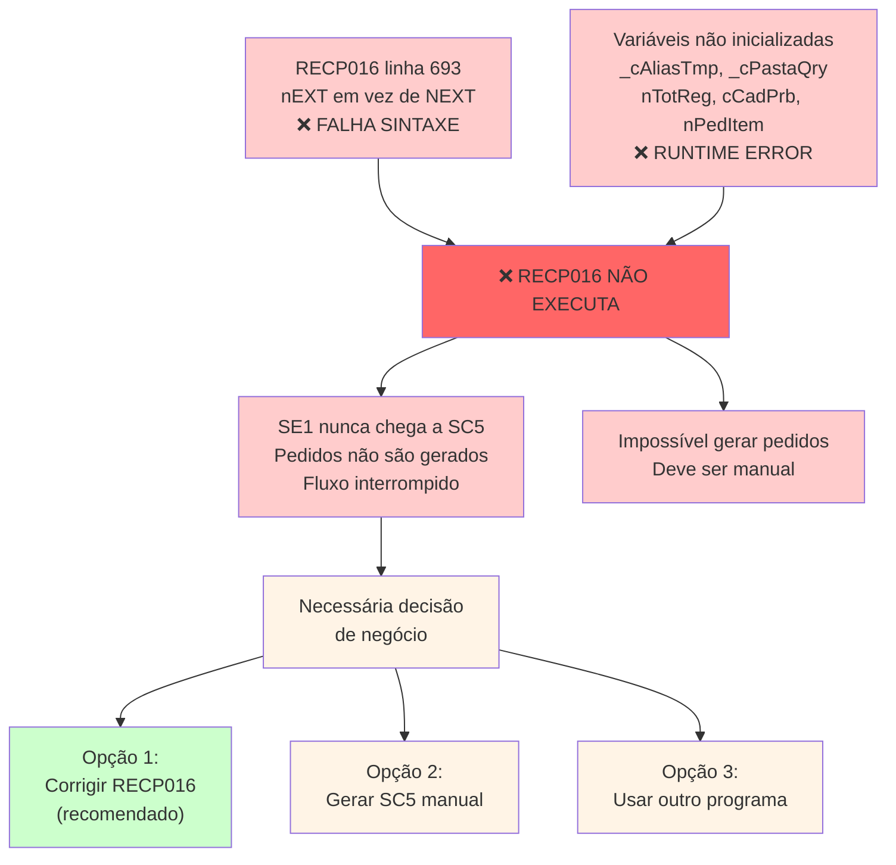
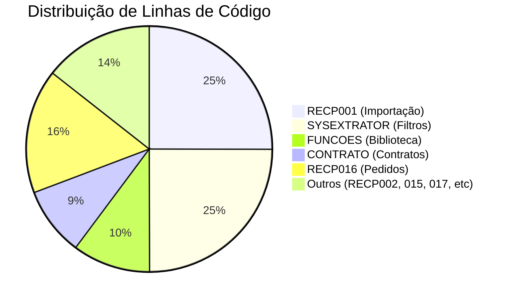

# PRW Protheus — Diagramas de Arquitetura e Fluxos

## DIAGRAMA 1: Arquitetura Geral (C4 - Contexto)



---

## DIAGRAMA 2: Fluxo Detalhado (Sequência)



---

## DIAGRAMA 3: Dependências Entre Módulos



---

## DIAGRAMA 4: Modelo de Dados (ERD Simplificado)



---

## DIAGRAMA 5: Estados de SE1 (Título)



---

## DIAGRAMA 6: Problemas Críticos (Mapa de Impacto)



---

## DIAGRAMA 7: Linhas por Programa (Análise de Complexidade)



---

## DIAGRAMA 8: Status de Execução (Semáforo)

```
┌─────────────────────────────────────────────────────────┐
│                    STATUS GERAL                         │
├─────────────────────────────────────────────────────────┤
│                                                         │
│  Compilação:              ❌ FALHA (RECP016)           │
│  Execução Importação:     ✅ OK                        │
│  Execução Validação:      ✅ OK                        │
│  Execução Contratos:      ✅ OK                        │
│  Execução Pedidos:        ❌ BLOQUEADO                 │
│                                                         │
│  Testes Unitários:        ❌ Não encontrados           │
│  Testes Integração:       ❌ Não encontrados           │
│  Documentação:            ❌ Ausente                   │
│                                                         │
│  RECOMENDAÇÃO: NÃO PROSSEGUIR PARA PRODUÇÃO            │
│                                                         │
└─────────────────────────────────────────────────────────┘
```

---

## PRÓXIMOS DOCUMENTOS RECOMENDADOS

- `02_MATRIZ_CRUD.md` — Mapeamento detalhado
- `03_BANCO_DE_DADOS.md` — Tabelas e constraints
- `04_RECOMENDACOES.md` — Roadmap
